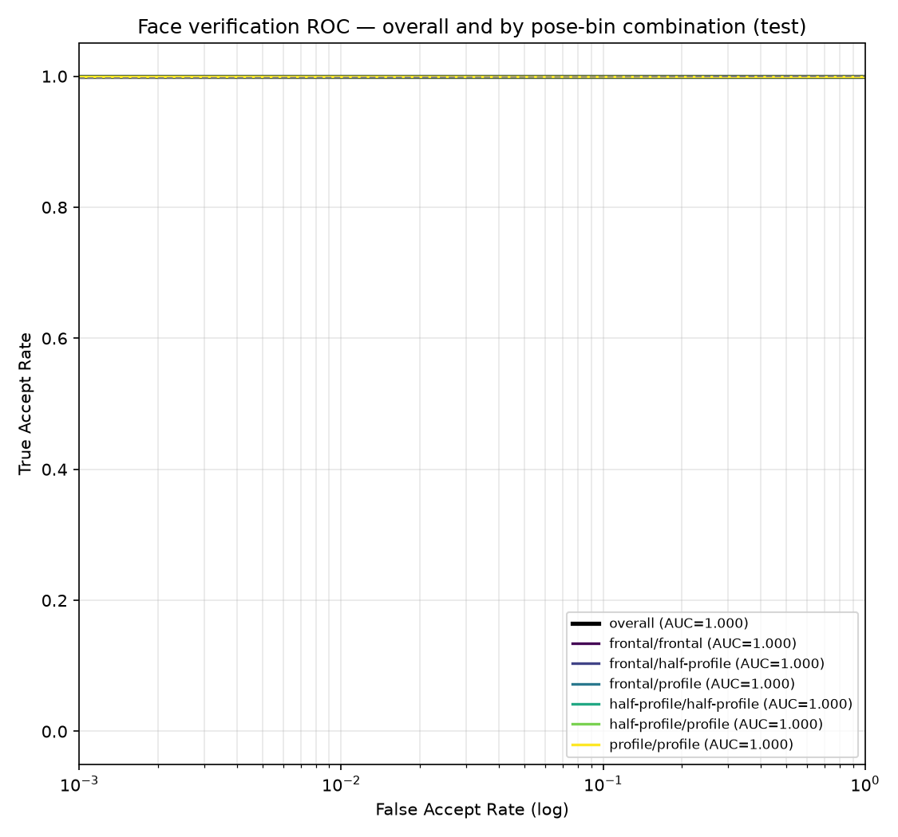
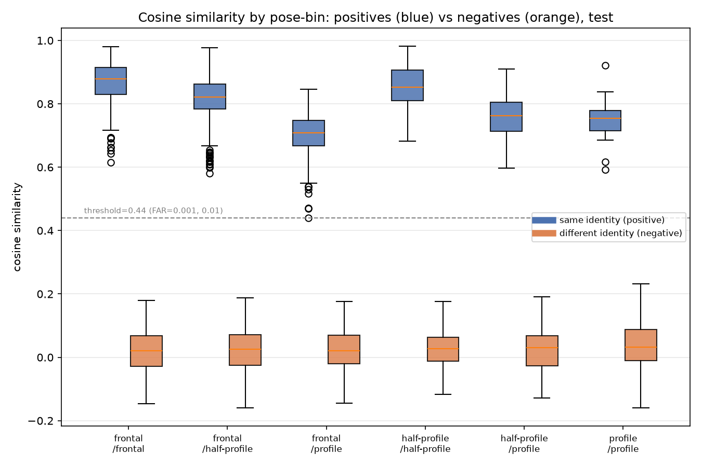
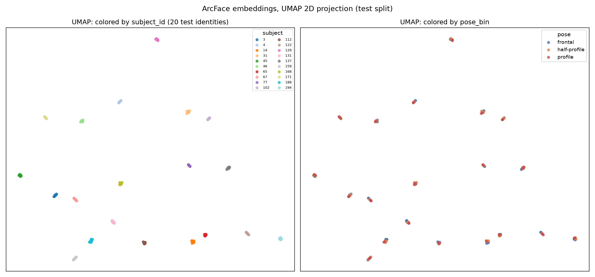
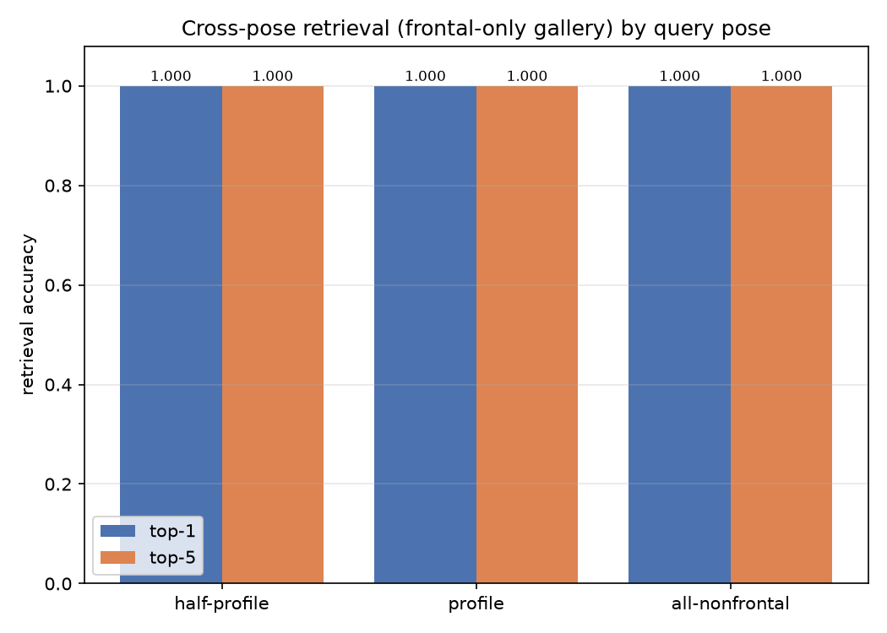

# pose-invariant-face-id

Pose-Invariant Face Verification: an identity-disjoint train/test face
verification system built on pretrained ArcFace embeddings, with an analysis of
how verification accuracy degrades as head pose (yaw) moves from frontal to
profile.

## Dataset

This project uses the **FEI Face Database** — 200 subjects × 14 images = 2800
color images, captured across roughly 180° of head rotation (frontal, half
profile, profile), with some illumination variation. Each file is named
`<subjectID>-<imageNum>.jpg` (subject IDs 1–200, image numbers 01–14).

Only the `originalimages_*` archives (the full pose range) are used for the main
pipeline. The `frontalimages_*` and `*_averagefaceimages` archives are optional
reference material and are not part of the pipeline.

> **Citation.** FEI Face Database, Artificial Intelligence Laboratory of FEI,
> São Bernardo do Campo, São Paulo, Brazil.
> Thomaz, C. E. and Giraldi, G. A., *A new ranking method for principal
> components analysis and its application to face image analysis*, Image and
> Vision Computing, 28(6):902-913, 2010.
> Project page: https://fei.edu.br/~cet/facedatabase.html

**Licensing note.** The `LICENSE` file in this repo (Apache 2.0) covers the
*code*. The FEI images themselves are governed by the FEI Face Database's own
terms (research/academic use); raw and processed images are **not** redistributed
in this repository (see `.gitignore`).

### Detection coverage note

Of the 2800 images, **2782 (99.4%) were successfully detected and aligned**;
**18 could not be detected**, even after a fallback pass with a larger detector
input (1024) and a lowered detection threshold (0.1). All 18 are the image
index `-14`, which in FEI is a **frontal shot under a dark illumination
condition**. For these 18 subjects the frame is effectively black (mean pixel
brightness ≈ 2/255, versus ≈ 72/255 for the other 182 `-14` images), so no face
is visible for RetinaFace to localize — this is an **illumination** failure, not
a pose failure. Because the affected images are frontal, their exclusion very
slightly reduces coverage of the low-light *frontal* condition; it does **not**
bias the profile–profile evaluation bin. The affected subjects are 37, 38, 50,
63–65, and 107–118. All 18 remain logged as `status = no_face` in
`results/preprocess_log.csv`.

## Project structure

```
data/
  raw/            # extracted FEI original images (git-ignored)
  processed/      # aligned faces, embeddings, labels, splits (git-ignored)
src/
  preprocess.py       # face detection + landmark alignment (112x112)
  pose_estimation.py  # per-image yaw estimation + pose binning
  split.py            # identity-disjoint train/val/test split + pairs
  embed.py            # ArcFace (buffalo_l) 512-d embedding extraction
  evaluate.py         # ROC/AUC, EER, TAR@FAR, pose-binned breakdown
  visualize.py        # UMAP/t-SNE embedding scatter
  retrieval.py        # (optional) FAISS retrieval demo
notebooks/
results/          # logs, tables, plots
models/           # cached / fine-tuned weights (git-ignored)
app.py            # (optional) Gradio same-person demo
```

## Setup

```bash
python -m venv .venv
# Windows: .venv\Scripts\activate   |   *nix: source .venv/bin/activate
pip install -r requirements.txt
```

## Pipeline

1. **Data prep** — extract `originalimages_part1-4.zip` into `data/raw/`
   (200×14 = 2800 images verified).
2. **Preprocess** — `python src/preprocess.py`: RetinaFace detection + 5-point
   landmarks, aligned to 112×112 (ArcFace standard), saved to
   `data/processed/aligned/`. Failures logged to `results/preprocess_log.csv`.
3. **Pose labeling** — per-image yaw → bins: frontal `<20°`, half `20–60°`,
   profile `>60°`.
4. **Identity-disjoint split** — ~160 train / 20 val / 20 test subjects.
5. **Embeddings** — pretrained ArcFace (`buffalo_l`), 512-d.
6. **Evaluation** — verification metrics, overall and per pose-bin pair.
7. **Visualization** — UMAP/t-SNE of embeddings by identity and pose.
8. **Retrieval** — `python src/retrieval.py`: FAISS top-1/top-5, same-pose pool
   and a cross-pose (frontal-only gallery) variant.

## Demo

An interactive Gradio app compares two uploaded photos and reports whether they
are the same person, using the cosine-similarity threshold (0.44) frozen from
the validation split in Step 6.

```bash
python app.py
```

Then open the printed local URL. Each photo is detected + aligned, embedded with
ArcFace, and the two embeddings are compared by cosine similarity; the result
shows the verdict, the score, and its margin to the threshold.

## Results

### Goal

Measure how pose affects face **verification** ("are these two photos the same
person?") using a modern pretrained recognition model, under a strictly
**identity-disjoint** protocol — the identities used to pick the decision
threshold and to test are never seen during any training/fine-tuning. Because
the model is used off-the-shelf, this is a clean measurement of pretrained
ArcFace's pose robustness on FEI rather than a training experiment.

### Method summary

- **Detection & alignment.** RetinaFace (InsightFace `buffalo_l`) detects the
  face and 5 landmarks; each face is similarity-aligned to a 112×112 crop
  (ArcFace standard). 2782/2800 images aligned (the 18 failures are dark-frontal
  frames — see the coverage note above).
- **Pose labeling.** Head yaw is estimated per image with InsightFace's
  `landmark_3d_68` pose model and binned into **frontal** (`|yaw|<20°`),
  **half-profile** (`20–60°`), **profile** (`>60°`). Bin sizes: 1289 / 1159 /
  334. The mean estimated yaw is monotonic with the FEI capture index
  (image 1 ≈ −65°, images 5–6 ≈ 0°, image 10 ≈ +68°), validating the estimator.
- **Split.** 200 subjects → **160 train / 20 val / 20 test** identities (fixed
  seed 42), identity-disjoint (verified: zero subject overlap, no pair crosses a
  split boundary).
- **Pairs.** Positives = all within-subject image pairs; negatives = cross-
  subject pairs sampled to balance the six pose-bin combinations; negatives
  matched 1:1 to positives.
- **Embeddings.** Pretrained ArcFace `buffalo_l` (`w600k_r50`), 512-d, on the
  aligned crops. Verification score = cosine similarity of L2-normalized
  embeddings.
- **Protocol.** Thresholds are chosen **on val only** (FAR=1e-3 and 1e-2, both
  land at cosine **0.44**), then frozen and applied to test. AUC/EER are
  threshold-free. The sparse profile–profile bin gets a 1000-resample bootstrap
  95% CI on AUC.

### Verification (Step 6, test split, frozen val threshold = 0.44)

Overall: **AUC = 1.000, EER = 0.000, TAR@FAR=1e-3 = 0.999, accuracy = 1.000.**

| Pose-bin pair | n_pos | AUC | EER | TAR@1e-3 | acc@1e-2 | mean pos. cosine |
|---|---|---|---|---|---|---|
| frontal / frontal | 322 | 1.000 | 0.000 | 1.000 | 1.000 | **0.867** |
| half-profile / half-profile | 278 | 1.000 | 0.000 | 1.000 | 1.000 | 0.856 |
| frontal / half-profile | 699 | 1.000 | 0.000 | 1.000 | 1.000 | 0.818 |
| half-profile / profile | 228 | 1.000 | 0.000 | 1.000 | 1.000 | 0.760 |
| profile / profile | 21 | 1.000 | 0.000 | 1.000 | 1.000 | 0.751 |
| frontal / profile | 246 | 1.000 | 0.000 | **0.996** | 0.998 | **0.702** |

profile/profile AUC 95% CI (1000× bootstrap): **[1.000, 1.000]**.



**Key finding — the pose effect lives in the margin, not the decision.**
At the verification decision level the model is effectively pose-invariant:
AUC ≈ 1.0 and EER ≈ 0 in every bin, because impostor (different-identity)
similarity stays near 0.02–0.04 regardless of pose while genuine similarity
stays well above the 0.44 threshold. But the **genuine-pair similarity margin
shrinks monotonically as the two views diverge** — frontal↔frontal **0.867**
down to frontal↔profile **0.702** (a ~19% relative drop). The single
threshold failure in the entire test set is one frontal↔profile pair (min
similarity 0.44), which pulls that bin's TAR@FAR=1e-3 to 0.996 while every other
bin stays 1.000. Negatives are flat across pose, so pose narrows the genuine
margin without inflating impostor scores.



### Embedding geometry (Step 7, UMAP / t-SNE on test embeddings)

Silhouette score (cosine, on the raw 512-d vectors; higher = better separated):

| Grouping | Silhouette |
|---|---|
| by **identity** | **0.777** |
| by **pose_bin** | **−0.006** |

**The embedding encodes identity dominantly and pose barely at all.** The 20
test identities form 20 tight, well-separated clusters; coloring the *same*
points by pose shows each cluster is an intermixed blend of frontal/half/profile
(near-zero pose silhouette). This clustering geometry is the mechanism behind
the pose-invariant verification and retrieval results.



### Retrieval (Step 8, test split)

**Same-pose pool** — each test image queried against all other test images;
correct if a same-identity image is in the top-k:

| Query pose | n_queries | top-1 | top-5 |
|---|---|---|---|
| frontal | 123 | 1.000 | 1.000 |
| half-profile | 115 | 1.000 | 1.000 |
| profile | 40 | 1.000 | 1.000 |

**Cross-pose (stricter)** — gallery = **frontal-only** test images; queries =
off-frontal images (a profile query must match a *frontal* image of the same
person):

| Query pose | n_queries | top-1 | top-5 |
|---|---|---|---|
| half-profile | 115 | 1.000 | 1.000 |
| profile | 40 | 1.000 | 1.000 |
| all-nonfrontal | 155 | 1.000 | 1.000 |



Both protocols saturate at 1.000. The cross-pose result is the stronger
statement: even in the hardest direction (profile → frontal gallery), every
query retrieves its same-identity match at rank 1.

### Demo

```bash
python app.py
```

Upload two photos → each is detected, aligned, and embedded with ArcFace → the
cosine similarity is compared against the frozen **0.44** threshold, and the app
reports "same / different person", the score, and the margin. Verified examples:
same person (frontal vs profile) → cosine 0.719 → SAME; different people →
cosine 0.098 → DIFFERENT.

### Dataset attribution & license

This project uses the **FEI Face Database** (Artificial Intelligence Laboratory
of FEI, São Bernardo do Campo, São Paulo, Brazil). Please cite:

> Thomaz, C. E. and Giraldi, G. A., *A new ranking method for principal
> components analysis and its application to face image analysis*, Image and
> Vision Computing, 28(6):902-913, 2010.
> Project page: https://fei.edu.br/~cet/facedatabase.html

The repository `LICENSE` (Apache 2.0) applies to the **code only**. The FEI
images are governed by the FEI Face Database's own research/academic terms and
are **not** redistributed here — raw images, aligned crops, and embeddings are
all git-ignored.

### Limitations

- **Ceiling effect / dataset realism.** All headline metrics saturate (AUC ≈ 1,
  retrieval 1.000) because FEI is a small, clean, controlled studio dataset with
  only 20 well-separated test identities and easy impostors. These numbers do
  **not** transfer to in-the-wild conditions (occlusion, low resolution,
  lighting, larger galleries, look-alikes). The informative signal here is the
  *shrinking genuine margin* with pose, not the saturated accuracy.
- **18 dark-frontal images excluded.** Image `-14` for 18 subjects is a near-
  black low-light frontal frame with no detectable face; these are dropped
  (logged as `no_face`). They reduce low-light frontal coverage slightly and do
  not affect the profile bins.
- **Yaw saturates at ~±65–68°.** The landmark-based pose estimator does not
  reach ±90°, so the truest profiles are likely under-counted in the `profile`
  bin (threshold `>60°`).
- **Sparse profile–profile positives.** Only 21 genuine profile–profile pairs
  exist in the test split, so that bin's metrics (and its [1.000, 1.000]
  bootstrap CI) reflect "all 21 easy pairs correct" rather than a
  well-estimated operating point.
- **Single model, no fine-tuning.** Results are for off-the-shelf ArcFace
  `buffalo_l`. AdaFace comparison was planned but skipped (no packaged pip
  distribution; weights only via Google Drive).
